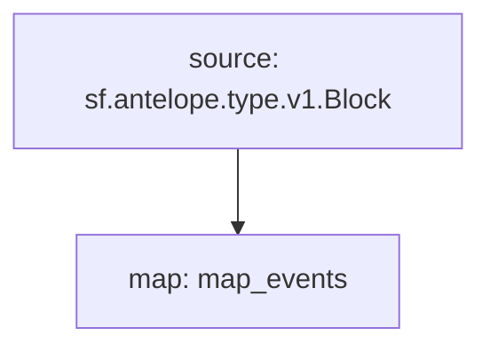

# WAX Marketplaces powered by **Substreams**

This substreams shows different types of events coming from NFTs marketplaces in the WAX ecosystem.

[Here](https://medium.com/wax-io/the-evolving-landscape-of-wax-nfts-4113288e673) is a quick description of these marketplaces.

For now, vIRL is not supported.

## Quick Start

```bash
make
make gui 
```

### Mermaid graph


### Modules
```yaml
Package name: waxmarketplaces
Version: v0.1.0
Modules:
----
Name: map_events
Initial block: 0
Kind: map
Output Type: proto:antelope.waxmarketplaces.v1.AnyEvents
Hash: 409209dba65de2f9ba4900a13dcd770d21bfaa8a
```